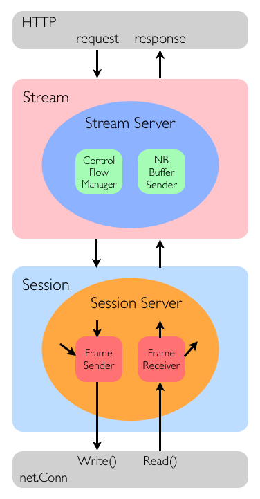
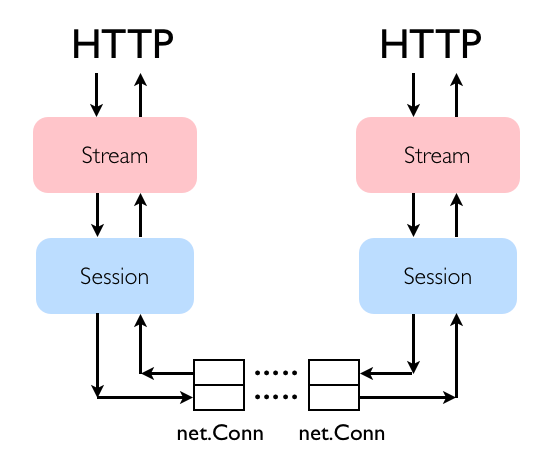

Amahi SPDY is a library for building SPDY clients and servers in Go, supporting [SPDY 3.1](http://www.chromium.org/spdy/spdy-protocol/spdy-protocol-draft3-1).

Check the only [documentation](http://godoc.org/github.com/amahi/spdy).

The goals for the library are reliability, streaming and performance.

1) Design for reliability means that network connections are assumed to disconnect at any time, especially when it's most inapropriate for the library to handle. This also includes potential issues with bugs in within the library, so the library tries to handle all crazy errors in the most reasonable way. A client or a server built with this library should be able to run for months and months of reliable operation. It's not there yet, but it will be.

2) Streaming, unlike typical HTTP requests (which are short), requires working with an arbitrary large number of open streams simultaneously, and most of them are flow-constrained at the client endpoint. Streaming clients kind of misbehave too, for example, they open and close many streams rapidly with `Range` request to check certain parts of the file. This is common with endpoint clients like [VLC](https://videolan.org/vlc/) or [Quicktime](https://www.apple.com/quicktime/) (Safari on iOS or Mac OS X). We have tested this library fairly intensely with streaming clients.

3) The library was built with performance and scalability in mind, so things have been done using as little blocking and copying of data as possible. It was meant to be implemented in the "go way", using concurrency extensively and channel communication. The library uses mutexes very sparingly so that handling of errors at all manner of inapropriate times becomes easier. It goes to great lengths to not block, establishing timeouts when network and even channel communication may fail. The library should use very very little CPU, even in the presence of many streams and sessions running simultaneously.

Architecture
============

The library is broken down in `Session` objects and `Stream` objects as far as the external interface. Each Session and Stream may have multiple goroutines and channels to manage their structure and communication patterns. Here is an overview diagram of how the pieces fit together:

Each Session controls the communication between two net.Conn connected endpoints. Each Session has a server loop and in it there are two goroutines, one for sending frames from the network connection and one for receiving frames from it. These two goroutines are designed to never block. Except of course if there are network issues, which break the Session and all Streams in the Session.

Each Stream has a server and in it there are two goroutines, a Northbound Buffer Sender and a Control Flow Manager. The NorthBound Buffer Sender is in charge of writing data to the http response and causes control flow frames being sent southbound when data is written northbound. The Control Flow Manager is the owner of the control flow window size.

In the end there are two copies of these stacks, one on each side of the connection.

Examples
========

We have a [reference implementation](https://github.com/amahi/spdy-proxy) of clients for the library, which contains an [origin server](https://github.com/amahi/spdy-proxy/blob/master/src/c/c.go), and a [proxy server](https://github.com/amahi/spdy-proxy/blob/master/src/p/p.go).

Testing
=======

It has been tested by building a the reference proxy and origin server and exercising them with multiple streaming clients, manually stressing of the proxy and origin server.

The reference implementation above also contains some [integration tests](https://github.com/amahi/spdy-proxy/tree/master/integration-tests). These do not cover a lot in terms of stressing the library, but are a great baseline.

As such, the integration tests should be considered more like sanity checks. We're interested in contributions that cover more and more edge cases!

Status
======

Things implemented:
 * `SYN_STREAM`, `SYN_REPLY` and `RST_STREAM` frames
 * `WINDOW_UPDATE` and a (fixed) control flow window
 * `PING` frames
 * DATA frames, obviously

Things to be implemented:
 * Support for SETTINGS frames
 * Actual implementation of priorities (everything is one priority at the moment)
 * Server push
 * GOAWAY and HEADERS frames
 * Variable flow control window size
 * NPN negotiation
 * Support for other than HTTP GET frames, i.e. POST, PUT or any request that has a body
 * Extensive error handling for all possible rainy-day scenarios specified in the specification
 * Support for pre-3.1 SPDY standards

Contributing
============

* Fork it
* Make changes, test them
* Submit pull request!

Credits
=======

Credit goes to Jamie Hall for the patience and persistance to debug his excellent SPDY library that lead to the creation of this library.

The library was started from scratch, but some isolated code like the header compression comes from Jamie's library as well as other libraries out there that we used for inspiration. The header dictionary table comes from the SPDY spec definition.

